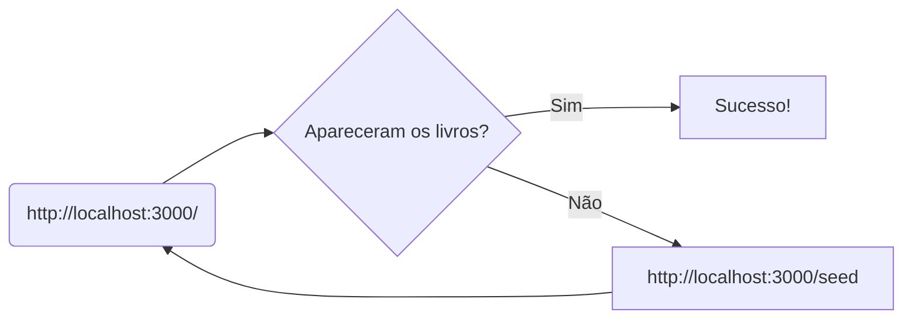

# Descrição: 
Projeto com a finalidade de criar dois containers, sendo um deles com a imagem do [MongoDB](https://www.alura.com.br/artigos/mongodb-o-banco-baseado-em-documentos) e o outro com a imagem de uma aplicação do [Alura books](https://hub.docker.com/r/aluradocker/alura-books), capaz de listar os livros cadastrados no banco de dados.

# Objetivo:
Aprofundar os estudos na criação coordenada de containers e estabelecer uma comunicação entre eles.

## Como testar:

Sistema operacional utilizado: 

* Instale o [Docker Compose](https://www.digitalocean.com/community/tutorials/how-to-install-and-use-docker-compose-on-ubuntu-20-04-pt).
* Faça o [download](https://github.com/davidneves11/estudos-docker/blob/main/Docker%20compose/docker-compose.yml) do arquivo e coloque-o dentro de uma pasta.
* Abra o ***terminal*** dentro da pasta onde o `docker-compose.yml` está e execute o seguinte comando:

    `docker compose up -d`
    
    _"Através desse comando, serão criados os dois containers com a sua conexão estabelecida."_
* Teste o funcionamento acessando o navegador através do endereço: `http://localhost:3000/`.
* Caso somente o corpo da aplicação apareça acesse `http://localhost:3000/seed` e depois acesse `http://localhost:3000/` novamente.

